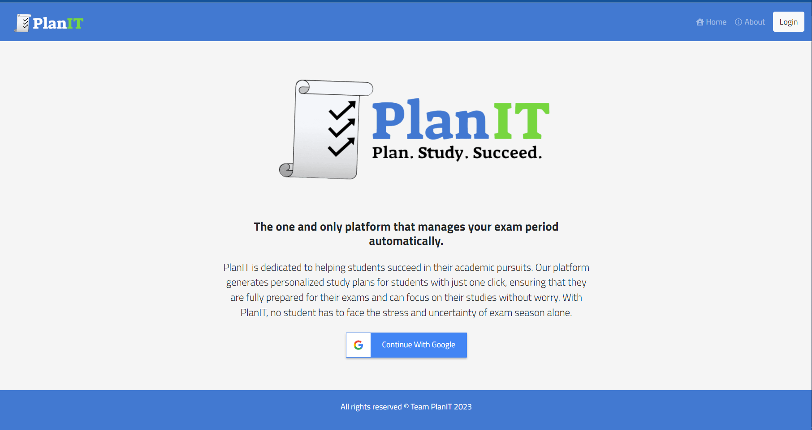
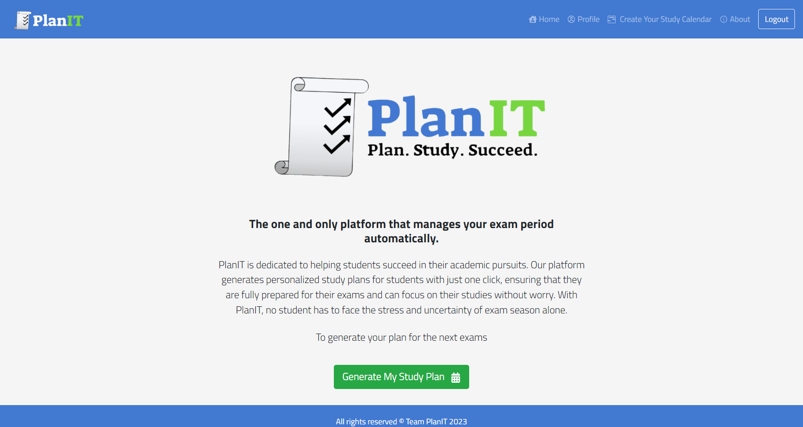
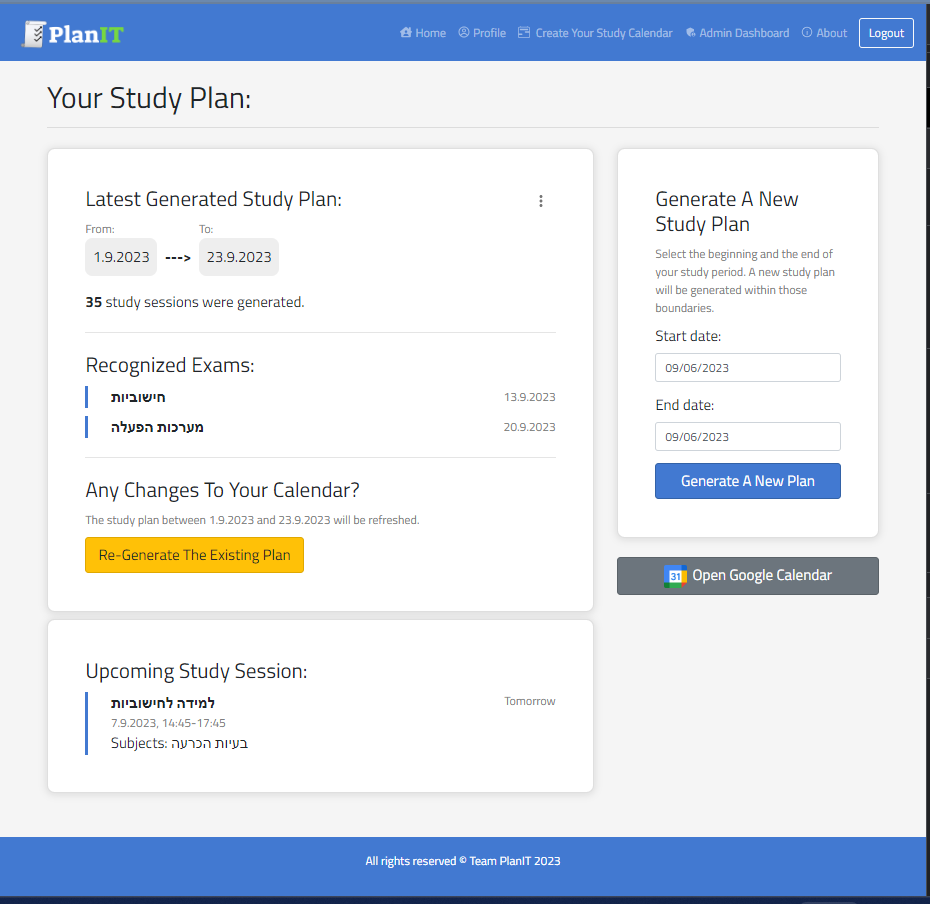

# PlanIT

A full-stack application that prepares study schedules for students during exam periods
This project involved implementing RESTful API and collaborating on GitHub to ensure efficient teamwork. 
The application is designed using the MVC architecture, with the server side written in Java using the Spring framework and connected to a MongoDB database. 
The website is developed using ReactJS. 
PlanIT's key features include the ability to scan student calendars using Google Calendar API, recognizing exams and courses, and creating a study plan. 
for a personalized and optimized study schedule, PlanIT considers the student's preferences and the courses' reputation.
Utillizes Google's Authorization and Authentication APIs.

## Screenshots of the site
Home screen before connecting

Home screen after connection

User profile

The calendar creation screen and generate it 

## The project programmers

- [@Danielsio](https://github.com/Danielsio)

- [@itayf9](https://github.com/itayf9)

- [@oshriFadlon1](https://github.com/oshriFadlon1)