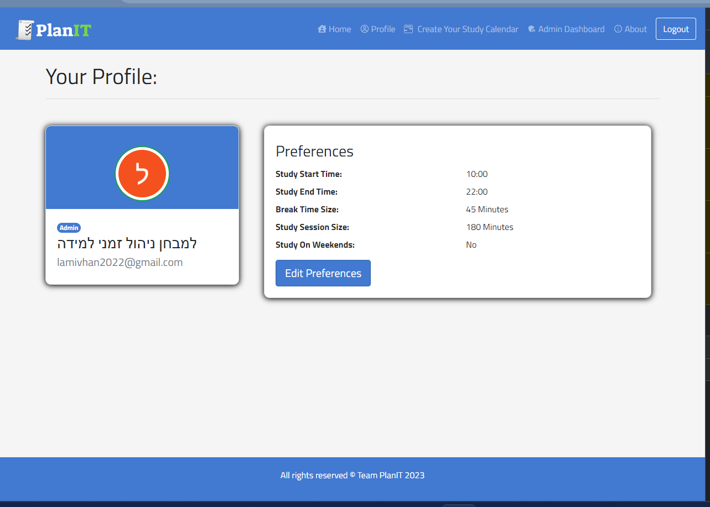

# PlanIT

An application that prepares smart study schedules for students during exam periods.

## Contributors:

- [Danielsio](https://github.com/Danielsio)
- [itayf9](https://github.com/itayf9)
- [oshriFadlon1](https://github.com/oshriFadlon1)

#### Related Repositories: [Plan-IT-Engine](https://github.com/itayf9/Plan_It_Enigne)

## Features:

- Generate a formulated study plan, based on various parameters:
  - The student's available time, gathered from its Google calendar (via Google Calendar API).
  - The student's study preferences, gathered using the Plan-IT website.
  - Information about the required preparations for the various courses, gathered from PlanIT's database.
- In the case of a new event being added to your calendar, regenerate the study plan to get an updated and relevant
  plan.
- Sign in to PlanIT website using your Google account (sign in with Google).
- The study plan will be shown directly in Google Calendar.
- An Administrator website, which allows modifying the PlanIT database and managing the system.

## Screenshots:

Home page

User's profile & preferences page

Plan Page

## Google Calendar

Before using PlanIT:

After using PlanIT:

